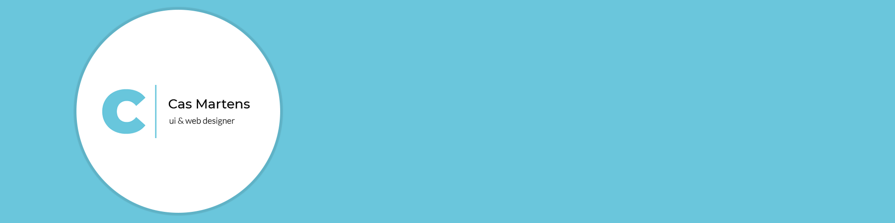

  

  
  
  
  

   

## Introduction

I'm a 19 year old media design student with a passion for combining design and development into a project. I'm  mainly interested in web design and development. However anything else along the way that grabs my interest is welcome in every way. In my free time I enjoy learning more about Node.JS by creating projects.    
One of those projects is called Castoe which is a Closed Source Discord Bot. This bot contains many features that can eventually be turned on or off with a web-dashboard that's written in ReactJS. However, since the bot itself is closed source, I've decided to create a small npm package which is open source. The open source npm package is called <a href="https://github.com/DevCassie/Castoe-Streamer">Castoe Streamer</a>. It's a logging utility to visually change the console output or write to a file. 

 

### Personal
👨 -> Pronouns are he and him 
🎸 -> I play an Ibanez AEG8EMH-OPN guitar 
📖 -> I enjoy reading self-development books 
💭 -> Big fan of motivational speakers and quotes 
🐺 -> Favorite animal is a wolf 
☯ -> Yin yang enthusiast and I consider myself a Toaist  

### Favourite quote 
> A man's eye seeks what can't be seen, yet it's there. It's hidden in the darkness, ready to be revealed.

 

## Github stats

## Technologies

</img>
</img>
</img>
</img>
</img>
</img>
</img>
</img>
</img>

